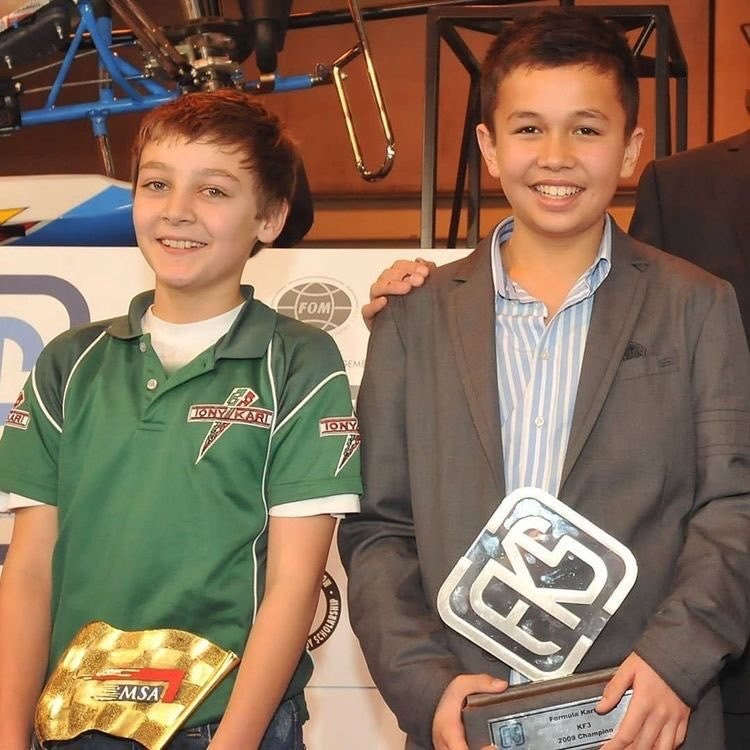

 
 
   <h3> $\color{aqua}{\textsf{𓆝 𓆟 𓆞⋆. 𓆝⋆. 𓆞 .⋆𓆝 𓆟 𓆞⋆. 𓆝}}$ </h3>

 
"ɴᴇᴠᴇʀ ʟᴇᴀᴠɪɴɢ ꜰᴏʀᴇᴠᴇʀ."

       

 

<align="center"> 

<align="center"> 
   

       
   

  

<h3>ᴀᴀ²³ ˗ˋˏ♡ˎˊ˗ ɢʀ⁶³</h3>

[𝐚𝐭𝐚](https://fishjam.atabook.org/) [𝐬𝐭𝐫𝐚𝐰](https://fishjam.straw.page/)

<!--
**Fishjam0422/Fishjam0422** is a ✨ _special_ ✨ repository because its `README.md` (this file) appears on your GitHub profile.

Here are some ideas to get you started:

- 🔭 I’m currently working on ...
- 🌱 I’m currently learning ...
- 👯 I’m looking to collaborate on ...
- 🤔 I’m looking for help with ...
- 💬 Ask me about ...
- 📫 How to reach me: ...
- 😄 Pronouns: ...
- ⚡ Fun fact: ...
-->
